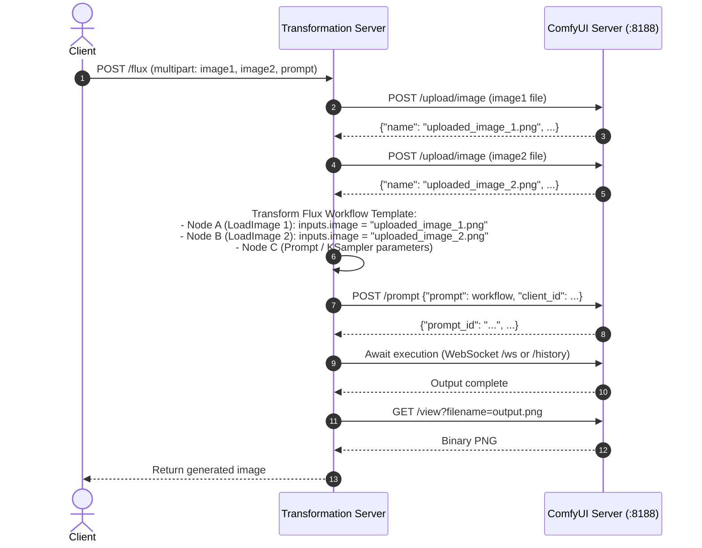

# ComfyUI Image Upload & Workflow Referencing Guide

This document captures primary research findings on uploading images to a self-hosted ComfyUI server and referencing them within execution workflows.

---

## 1. ComfyUI Upload Endpoint Specification

ComfyUI exposes a dedicated HTTP endpoint for uploading images into its server storage.

* **Endpoint**: `POST /upload/image`
* **Content-Type**: `multipart/form-data`
* **Destination Storage**: Saved into the server's `ComfyUI/input/` directory.

### Multipart Form Fields

| Field Name | Type | Required | Description |
| :--- | :--- | :--- | :--- |
| `image` | `File / Binary` | **Yes** | The binary image file payload (PNG, JPEG, WebP). |
| `overwrite` | `string / boolean` | No | If `"true"`, replaces an existing file with the same filename. Defaults to `"false"` (which appends ` (1)`, ` (2)`, etc.). |
| `subfolder` | `string` | No | Optional subfolder path under `ComfyUI/input/` (e.g., `flux_inputs`). |
| `type` | `string` | No | Destination category: `"input"` (default), `"temp"`, or `"output"`. |

### Server Response Payload

Upon successful upload (HTTP `200 OK`), ComfyUI returns a JSON object confirming the stored filename:

```json
{
  "name": "example_image.png",
  "subfolder": "",
  "type": "input"
}
```

> [!NOTE]
> If `overwrite` is `false` and `example_image.png` already exists on the server, ComfyUI auto-renames the uploaded file to `example_image (1).png`. Always use the `name` field returned in the response when populating workflows.

---

## 2. Referencing Uploaded Images in Workflow JSON

In ComfyUI API workflows, image inputs are loaded via nodes of type `LoadImage`.

### `LoadImage` Node JSON Structure

```json
{
  "12": {
    "inputs": {
      "image": "example_image.png",
      "upload": "image"
    },
    "class_type": "LoadImage",
    "_meta": {
      "title": "Load Image"
    }
  }
}
```

* **`inputs.image`**: Set to the filename returned from the `/upload/image` response (or `subfolder/filename.png` if a subfolder was specified).
* **`inputs.upload`**: Typically `"image"` to denote an uploaded asset.

---

## 3. Workflow for Handling Multiple Images (Flux Endpoint)

When the `/flux` endpoint receives 2 images (e.g. `image1` and `image2`):



### Step-by-Step Implementation in TypeScript (Deno)

```typescript
// 1. Upload first image
const upload1 = await uploadImageToComfyUI(
  destinationUrl,
  image1Bytes,
  image1Filename,
);

// 2. Upload second image
const upload2 = await uploadImageToComfyUI(
  destinationUrl,
  image2Bytes,
  image2Filename,
);

// 3. Inject filenames into workflow template placeholders or node inputs
const workflow = JSON.parse(fluxTemplateJson);
workflow["node_load_image_1"].inputs.image = upload1.name;
workflow["node_load_image_2"].inputs.image = upload2.name;

// 4. Submit prompt to ComfyUI
const result = await executeComfyUIWorkflowSync(destinationUrl, workflow);
```

---

## 4. Primary Sources & Citations

1. **ComfyUI Server Routes (`server.py`)**: Defines `POST /upload/image` and `POST /upload/mask` handling multipart requests and saving to `folder_paths.get_input_directory()`.
   - Source: [comfyanonymous/ComfyUI (server.py)](https://github.com/comfyanonymous/ComfyUI)
2. **ComfyUI Official API Docs**:
   - Source: [comfy.org API Reference](https://comfy.org)
3. **LoadImage Node Definition (`nodes.py`)**: `LoadImage.INPUT_TYPES` expects `image` matching filenames in `input` directory.
   - Source: [comfyanonymous/ComfyUI (nodes.py)](https://github.com/comfyanonymous/ComfyUI)
